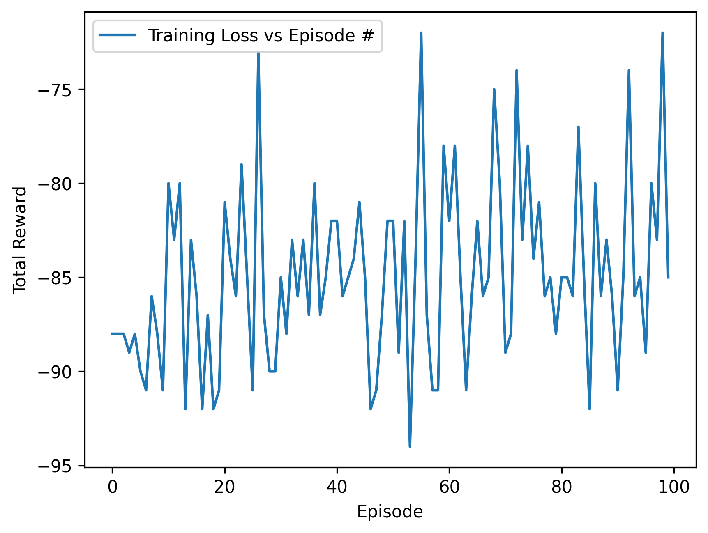

<h1>History of Pacman Training:</h1>
 
<h3>Attempt 1<h3>
For this run, the following parameters were used:
<ol>
    <li>BATCH_SIZE = 128></li>
    <li>GAMMA = 0.99</li>
    <li>EPS_START = 1</li>
    <li>EPS_END = 0.01</li>
    <li>EPS_DECAY = 1000</li>
    <li>TAU = 0.005</li>
    <li>LR = 1e-4</li>
    <li>num_episodes = 100</li>
</ol>
 
<h3>Attempt 2<h3>
<ol>
    <li>Increased EPS_DECAY from 1000 to 300000</li>
    <li>Decreased the LR from 1e-4 to 1e-5</li>
    <li>Increased num of episodes from 100 to 500</li>
</ol>
 
<h3>Attempt 3<h3>
<ol>
    <li>Same as attempt 2</li>
</ol>
 
<h3>Attempt 4</h3>
<ol>
    <li>Normalized the inputs by dividing pixel values by 255</li>
</ol>

 
<h3>Attempt 5</h3>
<ol>
    <li>Same as attempt 4</li>
</ol>
 
<h3>Attempt 6</h3>
<ol>
    <li>Decreased batch size from 128 to 64 </li>
</ol>
 
<h3>Attempt 7</h3>
<ol>
    <li>Tried EPS_DECAY=40000</li>
    <li>Started ignoring the first 140 frames while pacman initially spawns in.</li>
    <li>Implemented frame skipping to choose an action every 4 frames</li>
    <li>Waited 128 frames after pacman lost a life.</li>
    <li>Set the reward to -50 if pacman lost.</li>
</ol>
 
<h3>Attempt 8/9</h3>
<ol>
    <li>Limited episodes to 1 life.</li>
</ol>
 
<h3>Attempt 10</h3>
<ol>
    <li>Tried to not optimize the model or save to replay memory while pacman was respawning, or frames were being skipped</li>
</ol>
 
<h3>Attempt 11</h3>
<ol>
    <li>Set replay memory capacity to 10000 (up from 1000)</li>
</ol>
 
<h3>Attempt 12</h3>
<ol>
    <li>Increased the batch size from 64 - 512</li>
</ol>
 
<h3>Attempt 13</h3>
<ol>
    <li>Decreased batch size back to 64</li>
    <li>Decreased EPS_DECAY to 20000</li>
</ol>
 
<h3>Attempt 14</h3>
<ol>
    <li>Set the learning rate to 5e-4</li>
    <li>Upped the EPS_DECAY to 1000000</li>
</ol>
 
<h3>Attempt 15 (Best Run So Far)</h3>
<ol>
    <li>BATCH_SIZE = 64</li>
    <li>GAMMA = 0.99</li>
    <li>EPS_START = 1</li>
    <li>EPS_END = 0.01</li>
    <li>EPS_DECAY = 1000</li> 
    <li>TAU = 0.005</li>
    <li>LR = 1e-5</li>
    <li>REPLAY_MEMORY_CAPACITY = 10000</li>
    <li>num_episodes = 5000</li>
</ol>
<h3>Attempt 16</h3>
<ol>
    <li>Changed epsilon decay to be per episode, rather than per step</li>
    <li>Change the reward for not collecting a pip from 0 to -1</li>
    <li>Changed the reward for collecting a pip from 1 to 10</li>
    <li>Changed the reward for eating the power pellet from 5 to 50</li>
    <li>Changed the reward for eating a ghost from 20 to 100</li>
</ol>